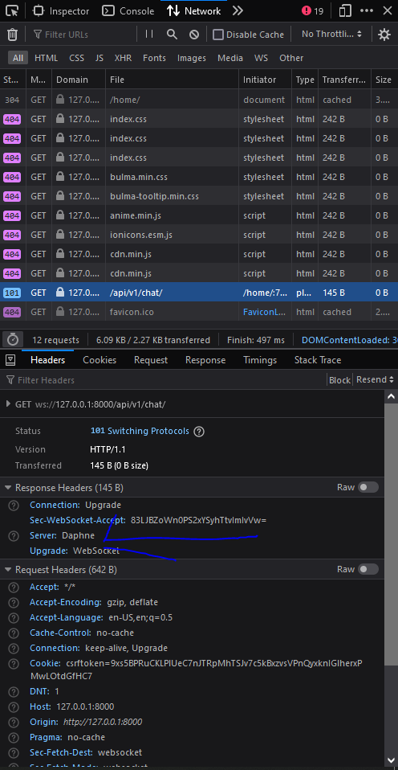
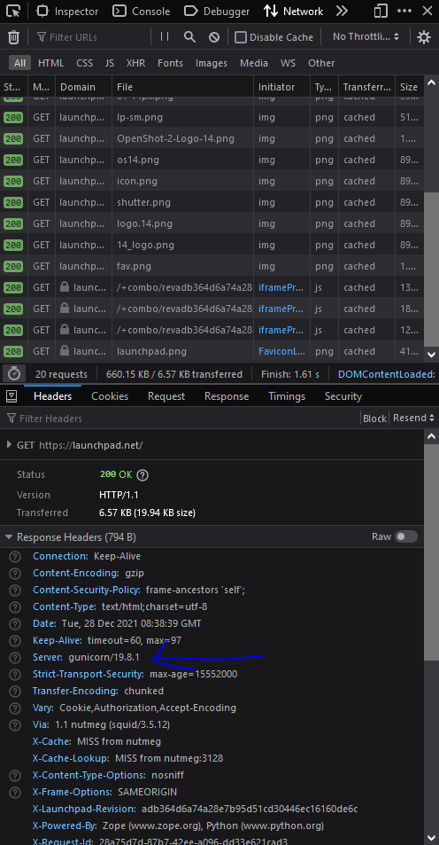
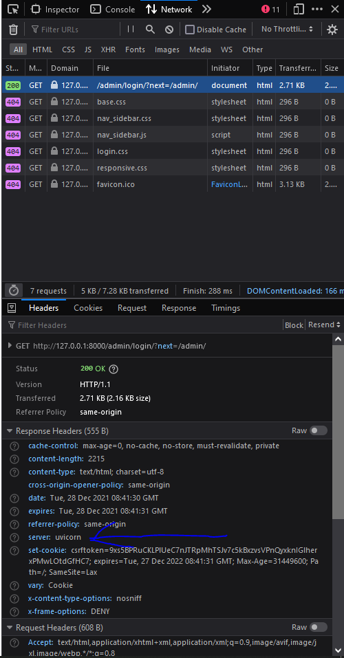

Back in the end of 2021 I was really amazed by `wappalyzer`. This seemingly small piece of extension can detect what the backend is ( albeit not guranteed ).

As I was relatively new to `django` back then I was amazed that many of the top sites are powered by django ( **・┆✦ʚ♡ɞ✦ ┆・** )!!! This was honestly a shock to me as most of people around me are talking all about PHP and stuff ( I mean PHP is not a bad language | Just gives too many opportunity to shoot yourself in the foot with bad practices )

# Context

`django` is a great framework written in python. It is **robust**, **secure** and generally pleasent to work with. The ASGI ( Asynchronus Server Gateway Interface ) framework written by django core team ( speally [`andrew`](https://github.com/andrewgodwin) ) was [`daphne`](https://github.com/django/daphne/). `dapnhe` was not detected by wappalyzer. This was annoying **（ミ￣ー￣ミ）**

# Modifying Wappalyzer

So being annoyed at `daphne` not being detected by `wappalyzer` ( which I mean it should ). I opened a [pull request](https://github.com/wappalyzer/wappalyzer/pull/5466) in the wappalyzer repo. Which [modified these lines](https://github.com/baseplate-admin/wappalyzer/blob/2e3dc7ccd29823003ef77ed79fc0dfaaa228f270/src/technologies/d.json#L231-L246)

```python
 "Daphne": {
    "cats": [
      22
    ],
    "headers": {
      "Server": "Daphne"
    },
    "implies":[
      "TwistedWeb",
      "Python",
      "Zope"
    ],
    "oss": true,
    "icon": "daphne.svg",
    "website": "https://github.com/django/daphne"
  },
```

The Pull Request was accepted by [@aliasio](https://github.com/AliasIO) but I was shocked to see that `daphne` was still not detected by `wappalyzed`. Then diving deeper, It was being detected on [my social media project](https://github.com/baseplate-admin/Social-Media/tree/d84c4971aff58c5a9a9c73767a9bb2f1440d917c/backend) but not on [my other project](https://github.com/baseplate-admin/animecore). Panic seized me as I was frantically looking for answers. It couldn't be happening cause I saw that `server` header detection was how `wappalyzer` understood the backend software. I was pretty much sure that I saw `daphne` on the server header on [my chat application](https://github.com/baseplate-admin/Social-Media/tree/d84c4971aff58c5a9a9c73767a9bb2f1440d917c/backend).

<center>



</center>

But then i realized that the header was only being sent on `websocket` responses but not on `http` responses.

# Opening an issue on github

I was quick to go to django [`daphne`](https://github.com/django/daphne/) github to open an [issue](https://github.com/django/daphne/issues/395) to investigate deeper into this mess. I thought that `django` was hiding `daphne` header intentionally to block out attackers ( this is not a good way to handle such use cases tbh ).

[@adamchainz](https://github.com/adamchainz) was quick to [respond](https://github.com/django/daphne/issues/395#issuecomment-1001920882) to me. Confirming that I was right on thinking that `django` `daphne` intentionally ( or maybe we had some sort of misunderstanding ).

Regardless I wanted the web to be open ( and by a large means allow others to see what they are doing ). So i tried defending my point. By pointing out that other web servers do they same and why should `django` `daphne` do things differently ? (`django` + `daphne` wasn't event that common | `django` + `uvicorn` was back then)

Then i pointed out other web servers doing things differently:

- Gunicorn :

  - Captured from : https://launchpad.net/ 

- Uvicorn :

  - Ran [my application](https://github.com/baseplate-admin/Social-Media/tree/d84c4971aff58c5a9a9c73767a9bb2f1440d917c/backend) with `uvicorn core.asgi:application` 

So why was `daphne` ( a less popular server doing things differently )? Also they were already exposing `server` headers via `websockets` !!!

I [countered](https://github.com/django/daphne/issues/395#issuecomment-1001936960) [@adamchainz](https://github.com/adamchainz) [argument](https://github.com/django/daphne/issues/395#issuecomment-1001920882)

> Adam : since it allows targeting servers when vulnerabilities become known

<blockquote>
Me : I totally agree with this. So we can add an option ( or use a django middleware to modify the headers ) to disable header for mission critical servers. eg:

```python
if SERVER_HEADER_HIDDEN:
    headers.pop('Server')
```

</blockquote>

Adam could finally understand me and [he proposed a Pull Request to resolve this issue](https://github.com/django/daphne/issues/395#issuecomment-1002013198).

I was thrilled to get a chance into working into `django`.. I mean it's `django`. The most popular web framework for `python`!!

# Opening a Pull Request to resolve this issue

When I looked into `daphne` source code. I came to realization that they are using [`twisted`](https://github.com/twisted/twisted) for their network stack. They were using [`autobahn`](https://github.com/crossbario/autobahn-python) for their websocket stack. Some poor chap before me [modified the `autobhan` header to be `daphne` header](https://github.com/django/daphne/blob/b0204165b1fc1ccb786e9ba65ad32d20f1fc83f5/daphne/ws_protocol.py#L82) and thats where I was getting the awkward `server` header thingy.

I came across a piece of code that was doing nothing but it felt like was doing something. ( the server header will not be daphne duh )

```python
if self.server.server_name and self.server.server_name.lower() != "daphne":
   self.setHeader(b"server", self.server.server_name.encode("utf-8"))
```

I replaced it with my own custom code

```python
if self.server.server_name and not self.responseHeaders.hasHeader("server"):
    self.setHeader(b"server", self.server.server_name.encode())
```

and low and behold things were looking very promising to begin with.

Then adam [reviewed my code](https://github.com/django/daphne/pull/396#discussion_r775915139) once again.. This change was not done by me. It was done by [black](https://github.com/psf/black)!!!

After some discussion I was able to resolve this issue and then ran into [another](https://github.com/django/daphne/pull/396#pullrequestreview-840911732). I have never written tests for software ( now that i am a bit older i know how important tests are )
So once again I was down a wild goose chase figuring out how to fix the tests.

After some digging around i wrote the tests

```python
 def test_no_servername(self):
    """
    Passing `--no-server-name` will set server name to '' (empty string)
    """
    self.assertCLI(["--no-server-name"], {"server_name": ""})
```

And this one too ( though adam [helped](https://github.com/django/daphne/pull/396#discussion_r775998730) me here )

```python
return sorted(
        [(b"server", b"daphne")]
        + [
            (name.lower(), value.strip())
            for name, value in headers
            if name.lower() not in (b"server", b"transfer-encoding")
        ]
    )
```

I then rewrote the `CHANGELOG` but ran into another roadblock. My wording was not good ?

<blockquote>
My wording : Added default headers to server response, so that if a response from backend didn't contain any server header it will automatically add a daphne server header.
</blockquote>

<blockquote>
Adam's wording : Always add the `Server` header, with value `Daphne`, when it isn’t already present.
</blockquote>

This didn't sound good to me. I counteracted with my own points.

<blockquote>
The header is hard coded for Websocket . We cannot change it from backend. ( Even if backend sends a header for websocket daphne overrides that | Thus it wasn't a correct implementation ). Check code and Issue and the pull request to change it.

Because when i profiled daphne, server header was a mask over Autobahn. Otherwise daphne reports that it's running AutoBahn and Twisted.

</blockquote>

Then [`Carlton`](https://github.com/carltongibson) dropped in and shared his [view](https://github.com/django/daphne/pull/396#pullrequestreview-841284864). As I feared he thought this can be used for malicious intent.

I again hopped in and [defended my view](https://github.com/django/daphne/pull/396#issuecomment-1002531931). I atleast want to give developers who share my view of a open web a chance to show their stack. ( this wasn't even possible as daphne would filter out the `server` header )

Some [chap before me](https://github.com/django/daphne/pull/231) tried to fix this issue. But he couldn't get it right and for some reason `andrew` thought things were fine.

Then `adam` hoped in and [saw my perspective](https://github.com/django/daphne/pull/396#issuecomment-1002535530).

I understood the plan and [gave developers the option to set custom server name](https://github.com/django/daphne/pull/396#issuecomment-1002567731) or ( [none if they prefer](https://github.com/django/daphne/pull/396#issuecomment-1036397709) ) set a default one if there was no argument give.

But still to my avail the Pull Request was not merged. At this point I thought there was nothing more I can do but to give them time.

After 2 months I again pinged [carlton](https://github.com/carltongibson) for a review. If this will ever get merged or will this get closed or not.

He disappeared again. At this point i moved away from this issue and continued my life ( as i had an important exam in December and i couldn't afford to waste time like this ) but to my surprise near april the PR was merged. This was unexpected to be honest and i was overwhelmed with joy.

Thats how I got my first PR merged into `django` `daphne`
