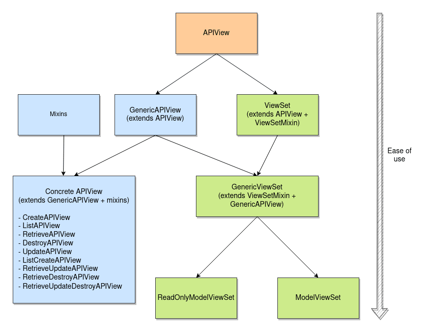
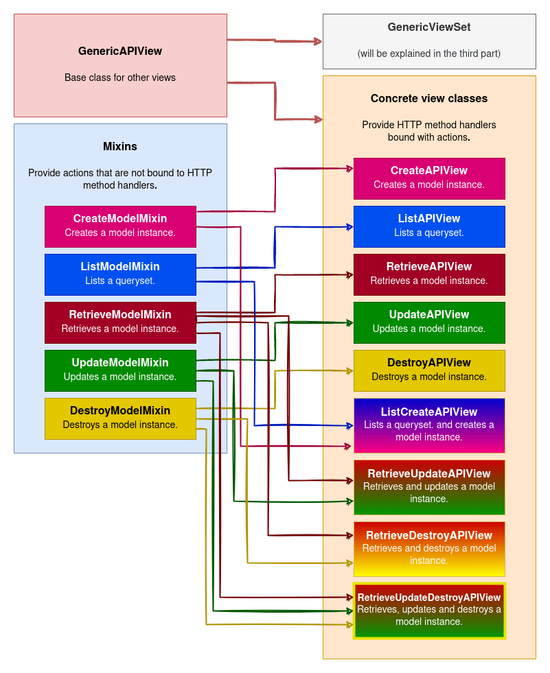

`django-ninja` is a relatively new framework ( [first commit was in July 21, 2020](https://github.com/vitalik/django-ninja/commit/1b79e8de644aef247e0456daa3b566db70fe1c07) ). So you might ask why would you use it instead of something like `django-rest-framework` ( whose first commit was all the way back in [Dec 30,2011](https://github.com/vitormazzi/django-rest-framework/commit/650111dc8c0800e5b7d4c878c1d454657b68efca) ). Well I am glad that you asked this question. Let's talk about it.

# Django Rest framework is slow

`django-rest-framework` is slow. Period. It's almost 2x-3x slower than `django-ninja`.

`django-rest-framework` does a whole lot of things under the hood. There are [articles](https://hakibenita.com/django-rest-framework-slow) explaining how to improve things ( specially with serializers ) with `django-rest-framework` but I am have not invested enough time to understand why `django-rest-framework` is slow.

To me ( an average developer developing his hobby project ) serialization should be fast. I shouldn't have to invest time into a project and realize that, "Oh shit. I fucked up while picking a good stack. Alright, buckle up, Sherlock! It's time to put on your detective hat, grab your magnifying glass, and embark on a whimsically peculiar investigation."

# Django Rest Framework lacks proper typing

While there's pacakges like [`djangorestframework-stubs`](https://pypi.org/project/djangorestframework-stubs/), `drf` was born in a time when there was a major transition between Python 2 to 3. There was no concept of a strongly typed python ( let alone `mypy` ).

So the typing implementation for `django-rest-framework` often feels hacky and glued onto. Not to mention that `djangorestframework-stubs` is an unofficial packages.

While the maintainers of `djangorestframework-stubs` is undoubtly talented, their implementation is not fixing the dumpster fire that is `django-rest-framework` and not all the projects are using typed python ( which they should to catch bugs before runtime ).

# Django Rest Framework lacks proper Swagger Support

When `django-rest-framework` was being actively worked on, tomchristie had another project named [`coreapi`](https://www.coreapi.org/). [`django-rest-framework` used to have first class support for `coreapi`](https://www.django-rest-framework.org/coreapi/). But @tomchristie's `coreapi` project never gained traction and [`coreapi` was eventually deprecated](https://github.com/encode/django-rest-framework/pull/7519).

You might ask why is this a big deal? Due to focusing effort on `coreapi`, `django-rest-framework` never got the same amount of love for `swagger` ( the de-facto openapi Swagger-compliant API ). Instead they made their own api renderer ( which is very very hard to customize properly due to how complex the autogenaration features are )

There are projects like [`drf-spectacular`](https://github.com/tfranzel/drf-spectacular) but it often requires extra effort on the developers part ( emphasizing my previous point about typing ), to achieve the functionality ( specially with `@extend_schema` decorator ). This implementation often feels lackluster comapred to competition.

# Django rest framework's magic

`django-rest-framework` has a lot of ways to achieve similiar functionality. Why should this be the case. There should be one way and one right way to achieve things ( look at `perl`. `perl` thought it would be nice for everyone to have a different way to achieve same functionality. Fast forward 10 years, nobody wants to touch that unholy mess ). Look at this diagram below ( shout out to [testdriven.io blog](https://testdriven.io/blog/drf-views-part-1/). You guys did a phenomenal job explaining things. ).





<center>
<sub>

Image credit : [testdriven.io](https://testdriven.io/blog/drf-views-part-1/)

</sub>
</center>

I as a simple developer should not have to memorize when to use what and as a paid developer shouldn't have to worry about those who preceeded me did a good job architecting the web application.

Then there are [concrete-view-classes](https://www.django-rest-framework.org/api-guide/generic-views/#concrete-view-classes) ( I hate it ). There are countless classes ( [which are just mixins](https://github.com/encode/django-rest-framework/blob/9cfa4bd7cca19df0bc8e456d906c3ab7ce285cf4/rest_framework/generics.py#L188-L295) ) added to [GenericAPIView](https://github.com/encode/django-rest-framework/blob/9cfa4bd7cca19df0bc8e456d906c3ab7ce285cf4/rest_framework/generics.py#L24) class. I mean whats the point? If you want people to mix and match. Just tell them to add mixins. Why are you making asumptions and making 10's ( well actually 9 ) of classes. God this irritates me so much. Wrapping your head around all these is a pain.

# Django Rest Framework's lack of maintaince

All the above problems could have been overlooked if `django-rest-framework` was maintained properly. At the time of writing developement has recently been resumed after a long long haitus. [Tom Christie's comment about things make it look bitter](https://github.com/encode/django-rest-framework/discussions/8110#discussioncomment-1120770).

I am shocked at this specific comment :

<blockquote>
 Otherwise we should be considering the project feature-complete.
</blockquote>

No way a project that is at the scale of `django-rest-framwork` is feature complete.

Why did I say this ?

1. `django-rest-framework` has no way to implement nested routing. Sure this could be achieved using `drf-nested-router`, but i have been disappointed at the project. Since a lot of people tend to use it but finds no good example repsitory ( or at least i didn't know how to find one ). [I have even raised an issue requesting this functionality](https://github.com/alanjds/drf-nested-routers/issues/285)
2. `django-rest-framework` had over 200 open issues and pull requests ( they silence old issues with stale bot instead of properly addressing the issues at hand )
3. [`django-rest-framework`'s `bootstrap` version is stuck at version 3](https://github.com/encode/django-rest-framework/blob/9cfa4bd7cca19df0bc8e456d906c3ab7ce285cf4/rest_framework/static/rest_framework/js/bootstrap.min.js#L2) [which was last updated at Feb 13,2019](https://github.com/twbs/bootstrap/commits/v3.4.1) which was about about 2 years ago since [`Tom Christie`'s comment](https://github.com/encode/django-rest-framework/discussions/8110#discussioncomment-1120770). A feature complete library shouldn't have old dependencies. [There's ongoing effort to move to bootstrap 5](https://github.com/encode/django-rest-framework/pull/7411) but it's been stale for over 2 years. I have proposed [making custom css](https://github.com/encode/django-rest-framework/pull/7411#issuecomment-1493374681) ( which should make it feature complete ) but i don't think it will ever be implemented.

Thing like `django-rest-framework` is the reason ( to me atleast ) is why django is not seeing significant market share. `django-rest-framework` is a relic of old era. It's time to move on to the next big thing in `django` ecosystem. That's `django-ninja`.

# Introducing `django-ninja`

`django-ninja`. Behold, a novel framework emerges as a shining beacon of salvation amidst the profound obscurity that envelops our current era. `django-ninja` gives us one and only one way to do things. So we are guranteed that projects developed using `django-ninja` follows a pattern.

Due to how `django-ninja` is developed, it emphasizes strongly on typed codebases. Which leads to good documentation along with good mypy error catching.

But `django-ninja` is not the silver bullet to every problem. It solves a set of problem but brings it's own set of problems.

# The devil is in the details

- While `django-ninja` is based on very good architecture, it suffers from the [fastapi problem](https://news.ycombinator.com/item?id=29471609). Which is there's one guy ( [@vitalik](https://github.com/vitalik/) ) doing everything. This exacerbates the vast number of open issues and PR's.
- Then there's the lack of ecosystem around `django-ninja`. [The sheer amount of packages made for `django-rest-framework` is mind boggling](https://github.com/encode/django-rest-framework/network/dependents?dependent_type=PACKAGE) [compared to measly 10-20 packages for `django-ninja`](https://github.com/vitalik/django-ninja/network/dependents?dependent_type=PACKAGE). I am confident this landscape will change in the next 10-20 years.
- By design, `django-ninja`'s name resolution is tied to import order ( I haven't come across any use case that is affected by this but [a django maintainer is not a fan of this](https://github.com/encode/django-rest-framework/discussions/8917#discussioncomment-5473287) )
- Along with this, `django-ninja` codes ( like `fastapi` ) can be overly verbose. ( which can be a good or bad thing depending on perspective )

  Let's take an example of [my code](https://github.com/baseplate-admin/CoreProject/blob/35919b9b27b984931e3e59e4eae76e62ce5d089a/backend/django_core/apps/api/views/anime/__init__.py#L32-L121) :

```python

@router.get("", response=list[AnimeInfoGETSchema])
@paginate
def get_anime_info(
    request: HttpRequest,
    filters: AnimeInfoFilters = Query(...),
) -> QuerySet[AnimeModel]:
    if not HAS_POSTGRES:
        raise Http404("Looksups are not supported on any other databases except Postgres")

    query_dict = filters.dict(exclude_none=True)
    query_object = Q()
    # 2 Step get query
    # There wont be a performance hit if we do all().filter()
    # https://docs.djangoproject.com/en/4.0/topics/db/queries/#retrieving-specific-objects-with-filters
    query = AnimeModel.objects.all()

    # We must pop this to filter other fields on the later stage
    if name := query_dict.pop("name", None):
        query = (
            query.annotate(
                similiarity=Greatest(
                    TrigramSimilarity("name", name),
                    TrigramSimilarity("name_japanese", name),
                    TrigramSimilarity("name_synonyms__name", name),
                )
            )
            .filter(
                similiarity__gte=0.3,
            )
            .order_by("-similiarity")
        )

    # Same here but with ids
    for id in [
        "mal_id",
        "kitsu_id",
        "anilist_id",
    ]:
        if value := query_dict.pop(id, None):
            _query_ = Q()
            for position in str(value).split(","):
                _query_ |= Q(
                    **{f"{id}": int(position.strip())},
                )
            query_object &= _query_

    # Staff lookups
    if staff := query_dict.pop("staffs", None):
        for position in staff.split(","):
            _query_ &= (
                Q(staff__name__icontains=position.strip())
                | Q(
                    staff__alternate_names__name__icontains=position.strip(),
                )
                | Q(staff__family_name__icontains=position.strip())
                | Q(staff__family_name__icontains=position.strip())
            )
            query_object &= _query_

    # Many to many lookups

    for item in [
        "genres",
        "themes",
        "studios",
        "producers",
        "characters",
    ]:
        if value := query_dict.pop(item, None):
            _query_ = Q()
            for position in value.split(","):
                _query_ &= Q(
                    **{f"{item}__name__icontains": position.strip()},
                )
            query_object &= _query_

    # This can be (AND: )
    # This means it is empty

    if query_object:
        query = query.filter(query_object).distinct()

    if not query:
        raise Http404(
            "No {} matches the given query with {}".format(
                query.model._meta.object_name,
                query_object,
            )
        )
    return query
```

<sub> See how long ( and complicated ) can a simple ( well not actually simple but detailed ) lookup function be ?</sub>

# Conclusion

There's no good solution to building rest api's with `django`. While `django-rest-framework` gives us multiple ways to achieve this functionality, it suffers from "there's more than one way to achieve same thing" and `django-ninja` suffers from "New kid on the block" problem.

Solving these type of problem is the key to getting more marketshare for `django`. Otherwise new frameworks like `fastapi` ( which inspired [`starlite`](https://github.com/starlite-api/starlite) which became [`litestar`](https://github.com/litestar-org/litestar) | You can find the creator's reasoning in this [reddit post](https://www.reddit.com/r/Python/comments/s0jgou/starlite_the_little_api_framework_that_can/) and this [medium article](https://itnext.io/introducing-starlite-3928adaa19ae) ) will flood the pypi registry and we will have new frameworks poping in left and right ( much like how people that were fed up with `react` wrote `preact` and now another project [`million`](https://github.com/aidenybai/million) is there to solve the problem both `react` and `preact` are solving ).

While `django-ninja` is not the silver bullet that solves every problem, it gives developers very strong base to build and extend upon. That's the main reason I chose `django-ninja` in hopes that it will take over `django-rest-framework` to become the de-facto way of building rest api's with `django`
